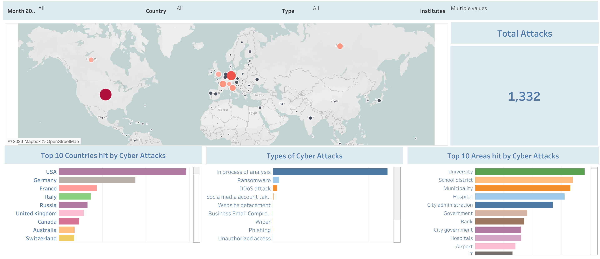

# Cyber Attacks 2022 Visualization

The purpose of this small project is to visualize cyber attacks in 2022 based on country, type, and area of fields all around the globe.\
In recent times I came across a lot of news about cyber attacks (including some hostels whose server was hacked for several months halting all the payment and email systems) in Germany so I thought to create a visualisation based on some data. Thanks to Bert Kondruss for collecting and providing publically available data at his website [here](https://konbriefing.com/en-topics/cyber-attacks-2022.html).

## Data Cleaning
 I started this project with the aim of using a web scraping technique using the BeautifulSoup library from Python to acquire data but then I found out this pandas html method to directly grab the table. df = pd.read_html(URL)[0]

The problem while reading this data was with null values. So some of the entries from the Country column are dropped and then also replaced in the State column.

Dropping rows where Country is empty df = df.dropna(subset=['Country']) or df.drop(index= df[df['Country'].isnull()].index, inplace= True, axis=0)

There is another special method where you can fill the values of the previous column to the next one if its value is empty. it was the case of city and state (some city and state names are the same). If you remove axis = 1 it will be true for rows. df.fillna(method='ffill', axis = 1)

One other major problem I faced, despite there being no missing values but the data entry of the Date column does not have all the information. There were some records in the date column, which are missing either month or year information. So we can fillforward date columns because of a specific order, to make it more helpful for further analysis.

### Data Visualization
After making the dashboard I came to see that the USA is the country with the most cyberattacks followed by Germany in the second and France in the third place. Similarly, from available information on cities, Roma ranks where the most cyber attacks have happened amounting to 22 attacks. London is second on the list followed by Moscow and New York.
 

Click [here](https://public.tableau.com/app/profile/chirag.arya4385/viz/CyberAttack2022_16953135674290/Dashboard?publish=yes) for tableau dashboard.

## Datasets Used
The datasets used include:
+ **Raw_data:** Raw data was accessed from the [Website link](https://konbriefing.com/en-topics/cyber-attacks-2022.html) using following Python html method: **df = pd.read_html(URL)[0]**.
  + **cyber.csv:** This dataset includes the information on the cyber attacks that took place around the world in the year 2022 cleaned and stored using Python libraries.
  
## Tools and Technologies Used
The tools used in this project include:
+ **Python** - This was needed to conduct Data Quality Assessment and also for Data Cleaning processes. With Python libraries **pandas, numpy, datetime** exploratory data analysis of the datasets and gaining useful insights from the data was possible.
+ **Tableau**- A Business Intelligence tool was required to explore data and visualize the data by creating charts, and graphs to come up with a Dashboard for Cyber attacks that took place in 2022 around the world.

## Built With
+ Python 3.10.11
+ Google Colab
+ Tableau

## Authors
+ Chirag Arya - [Github Profile](https://github.com/AryaChirag)
